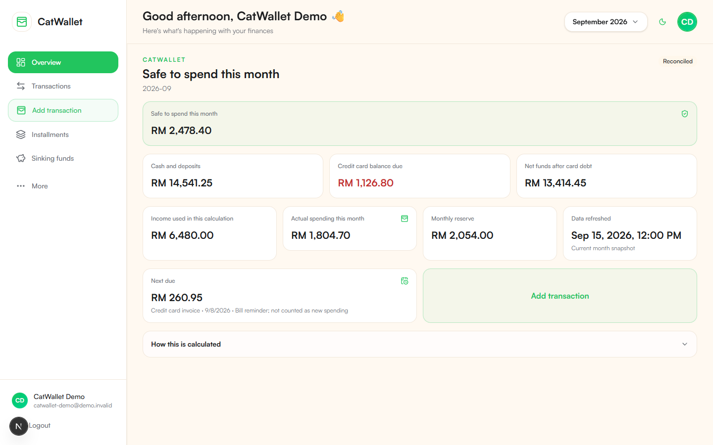
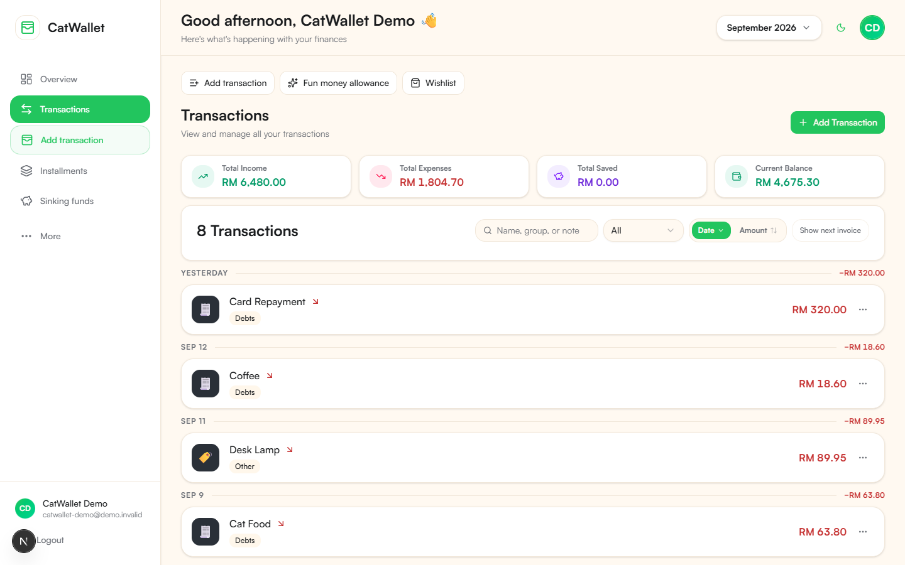
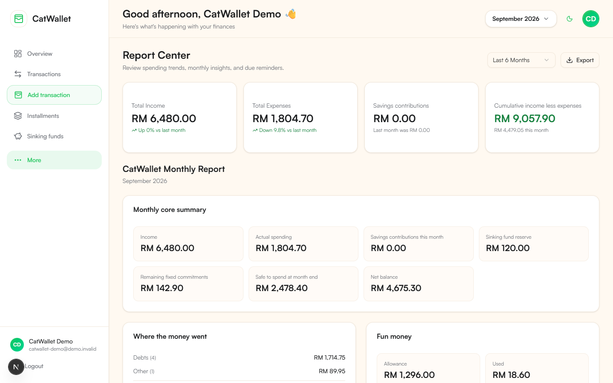
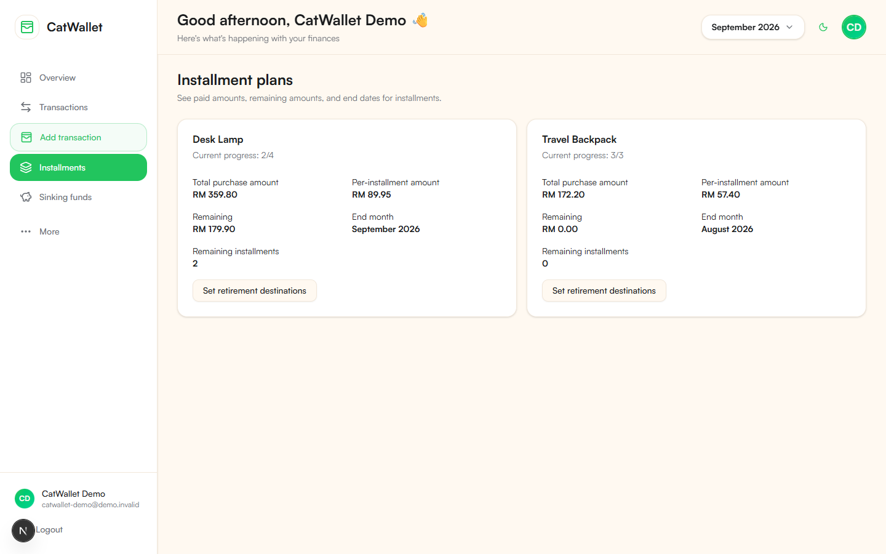
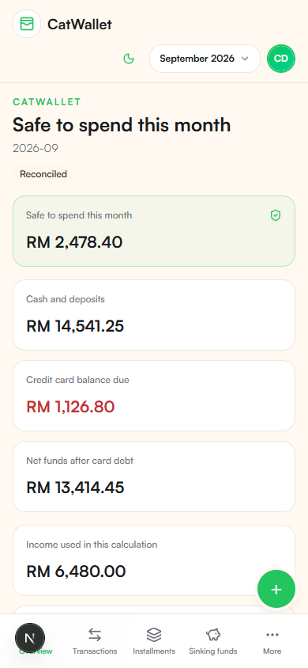

# CatWallet

[English](./README.md) | [简体中文](./README.zh-CN.md)

<p align="center">
  
</p>

<p align="center"><strong>Privacy-first, self-hosted personal finance with MCP-powered AI assistance.</strong></p>

[](https://github.com/yueyue95/CatWallet-OSS/actions/workflows/ci.yml)
[](https://github.com/yueyue95/CatWallet-OSS/actions/workflows/codeql-analysis.yml)
[](./LICENSE)

## Product screenshots

All screenshots below are generated from the real local UI with deterministic fictional data. No hosted account or financial record is used.



| Transactions                                                                                                      | Reports                                                                                            |
| ----------------------------------------------------------------------------------------------------------------- | -------------------------------------------------------------------------------------------------- |
|  |  |

| Planning                                                                                                | Mobile dashboard                                                                                |
| ------------------------------------------------------------------------------------------------------- | ----------------------------------------------------------------------------------------------- |
|  |  |

## The problem CatWallet solves

Personal-finance tools often trade privacy for convenience or flatten cash flow, liabilities, goals, and future commitments into one misleading balance. CatWallet keeps the ledger under your control and makes the important distinctions explicit: cash versus card liability, spending versus repayment, active versus completed installments, and available money versus already-promised money.

## Core capabilities

- **Safe to spend:** derives a practical monthly amount after active commitments, savings, and recorded spending.
- **Transactions and categories:** income, expenses, savings, and same-currency account transfers, with filtering, import semantics, soft deletion, and restoration.
- **Credit cards and repayments:** card liabilities, invoice periods, due dates, repayments, refunds, and transfers without double counting.
- **Reimbursements:** link partial or multi-party repayments to the original expense, preserve gross card spending, and report only the personal share without treating repayments as ordinary income.
- **Installments:** per-installment or total plans, in-progress imports without recreating paid history, future-occurrence reserves, safe fixed-commitment conversion, early completion, and atomic group-level deletion or restoration with archived-plan history.
- **Fixed commitments:** monthly, yearly, or custom recurring obligations.
- **Sinking funds:** planned reserves with an immutable contribution and withdrawal ledger.
- **Budgets and reports:** category limits, gross and reimbursed spending, personal share, monthly detail, trends, cumulative balances, and exports.
- **Goals and cooling list:** goal funding plus a deliberate waiting period for optional purchases.
- **MCP assistance:** read tools and explicitly authorized mutations for compatible AI clients.

## AI and MCP boundary

The MCP server is a recording and management assistant, not a financial adviser. It can explain stored data and prepare actions, but write operations remain subject to the user's explicit authorization and the same authenticated ownership checks as the web app. Do not give an AI client a broader token or scope than it needs.

## Privacy-first and self-hosted

CatWallet is designed for an operator-controlled Supabase project. User-owned tables enforce Postgres Row Level Security, sensitive text fields are encrypted by the application, and no service-role key is used in browser code. This repository contains no hosted database, online demo, production environment, or real seed data.

## Technology stack

- Next.js 16 and React 19
- TypeScript 6
- Supabase Auth and Postgres with RLS
- Model Context Protocol (MCP)
- Tailwind CSS, Radix UI, and Recharts
- Vitest and Playwright

## Local development quick start

Requirements: Node.js 24, Corepack, Docker, and Git.

```bash
git clone https://github.com/yueyue95/CatWallet-OSS.git
cd CatWallet-OSS
corepack enable
corepack prepare pnpm@11.22.0 --activate
pnpm install --frozen-lockfile
cp .env.example .env.local
pnpm exec supabase start
pnpm exec supabase db reset --local --yes
pnpm dev
```

Generate a 32-byte base64 `FIELD_ENCRYPTION_KEY` locally and place it only in `.env.local`. Open `http://127.0.0.1:3000`.

## Docker Compose quick start

Start the local Supabase stack first, complete `.env.local`, then run:

```bash
docker compose --env-file .env.local build
docker compose --env-file .env.local up -d
```

The Compose volume stores only the Next.js cache. Postgres data remains in the local Supabase Docker volumes. Stop without deleting data using `docker compose --env-file .env.local down`.

## Create a Supabase project from scratch

1. Create a new Supabase project owned by you, or use the local CLI stack.
2. Copy `.env.example` to `.env.local` and set the project URL, publishable key, and a locally generated field-encryption key.
3. Apply every file in `supabase/migrations/` in filename order. For local development, `pnpm exec supabase db reset --local --yes` does this automatically.
4. In Supabase Auth, enable email/password and add your exact `/auth/callback` and `/auth/update-password` URLs.
5. Configure optional OAuth providers with secrets stored only in the provider or hosting platform.
6. Verify RLS with `pnpm test:integration:local` before entering meaningful data.

Never use a production project as a development or demo target.

## Environment variables

`.env.example` documents the supported variables using placeholders only:

- `NEXT_PUBLIC_SUPABASE_URL`: browser-safe Supabase API URL.
- `NEXT_PUBLIC_SUPABASE_PUBLISHABLE_KEY`: browser-safe publishable key.
- `SUPABASE_SERVER_URL`: optional server-side URL for container networking.
- `FIELD_ENCRYPTION_KEY`: server-only base64-encoded 32-byte key.
- `NEXT_PUBLIC_SITE_URL`: canonical URL for your own deployment.
- `CATWALLET_MCP_*`: optional MCP resource, authorization, origin, scope, and time-zone controls.

Do not commit `.env.local`, tokens, passwords, connection strings, browser state, or database dumps.

## Deterministic local demo

The demo tooling accepts only `localhost` or `127.0.0.1` Supabase endpoints and fails closed for any hosted or LAN target. It uses a fixed reference date, `Asia/Kuala_Lumpur`, MYR, and clearly fictional accounts and transactions.

```bash
pnpm demo:reset
pnpm demo:screenshots
```

The second command resets the local database again, launches the real app, captures ten Playwright screenshots, and builds a contact sheet. Runtime credentials and the generated encryption key live only under ignored `.demo/`. See [Demo data and screenshots](./docs/demo.md).

## MCP configuration

Run the stdio server with `pnpm mcp:start`. Configure the resource URL, authorization server, exact hosts and origins, audience, scopes, and time zone through environment variables described in `.env.example`. Keep bearer tokens in the MCP client's secret store; never put them in this repository or a command checked into shell history.

## Tests, build, and security checks

Coverage uses the verified initial OSS baseline from the stable Production source: 74.44% statements, 67.90% branches, 71.94% functions, and 75.44% lines. This is a non-regression floor, not a quality ceiling; raise the thresholds in `vitest.config.ts` whenever coverage improves.

```bash
pnpm format:check
pnpm lint
pnpm typecheck
pnpm test
pnpm test:integration:local
pnpm mcp:test
pnpm build
pnpm e2e
pnpm security:audit
pnpm security:trivy
```

Integration and E2E suites require the isolated local Supabase stack. GitHub Actions run quality, CodeQL, dependency, Semgrep, Trivy, local E2E, and local-only ZAP checks; none deploy the application.

## Generic deployment guide

1. Provision your own Supabase project and hosting provider.
2. Apply migrations before starting the new application version.
3. Set secrets in the hosting platform, not in Git.
4. Configure exact Auth callback, MCP Host, Origin, issuer, audience, and scope values.
5. Build with `pnpm build`, deploy the resulting Next.js application, and run read-only smoke checks.

CatWallet is not tied to a particular Vercel team, Supabase project, domain, or deployment workflow.

## Backups and migration upgrades

Back up both code and the database before upgrades. A source rollback does not roll back Postgres. Record the applied migration version, create encrypted logical dumps in a controlled location outside the repository, test restoration, then apply new migrations in order. Never upload financial dumps to GitHub artifacts or releases.

## Project documents

- [Security policy](./SECURITY.md)
- [Contributing](./CONTRIBUTING.md)
- [Code of Conduct](./CODE_OF_CONDUCT.md)
- [Changelog](./CHANGELOG.md)
- [Architecture](./docs/architecture.md)
- [Authentication](./docs/auth.md)
- [Database](./docs/database.md)
- [End-to-end testing](./docs/e2e.md)
- [License](./LICENSE)
- [Notices](./NOTICE.md)

## Upstream attribution

CatWallet is based on [Dragg](https://github.com/fsousac/Dragg). The original Felipe de Sousa MIT copyright and license are preserved in [LICENSE](./LICENSE); additional attribution is in [NOTICE.md](./NOTICE.md). CatWallet is an independent derivative project, not an official Dragg release.

## Not financial advice

CatWallet records and visualizes information you provide. It does not provide financial, tax, investment, or legal advice, and its calculations should be independently reviewed before you make decisions.
