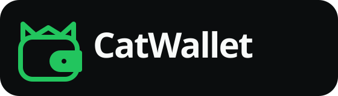
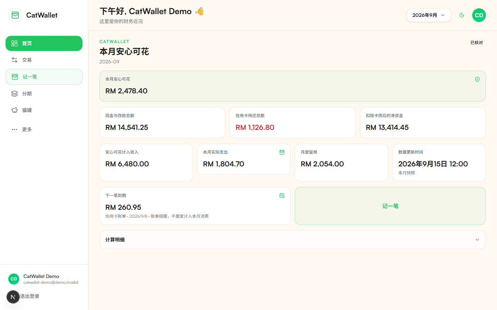
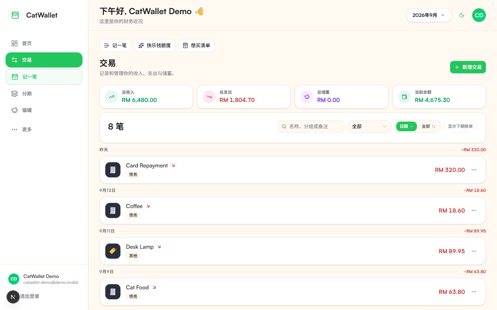
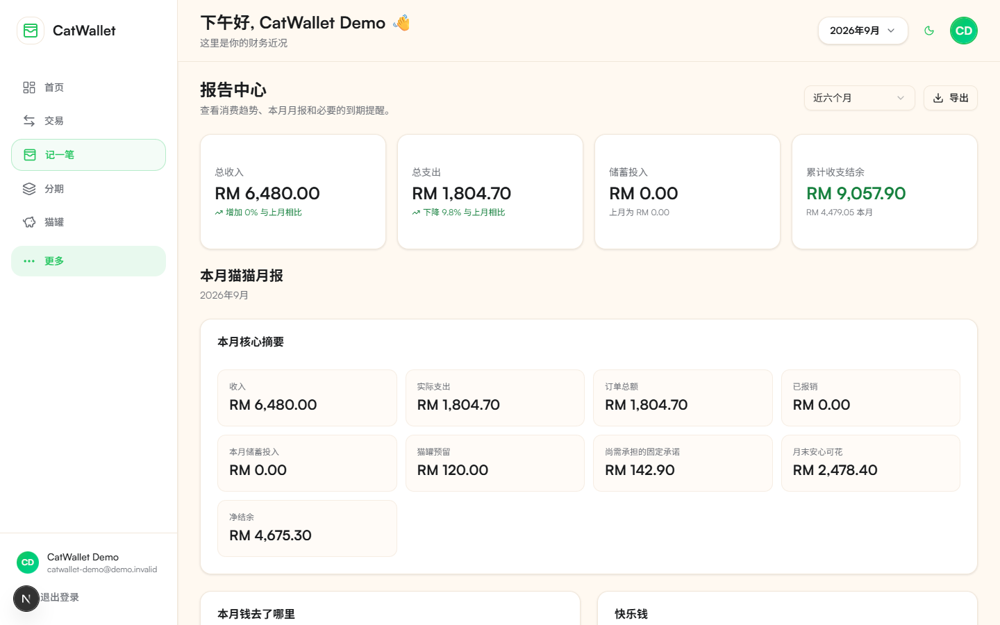
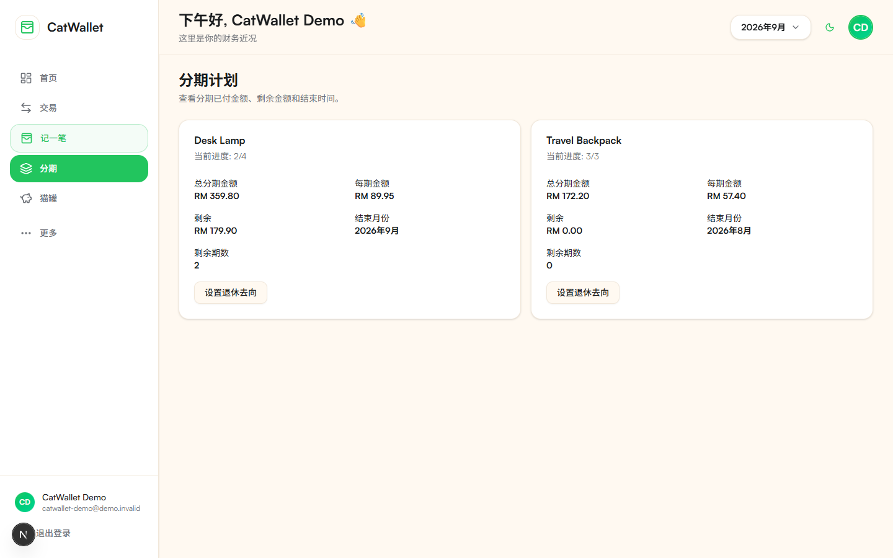
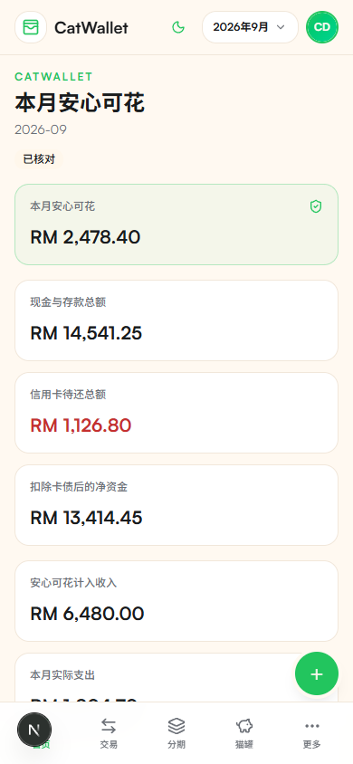

# CatWallet（猫猫钱包）

[English](./README.md) | [简体中文](./README.zh-CN.md)

<p align="center">
  
</p>

<p align="center"><strong>隐私优先、可自行托管，并由 MCP AI 助手协助管理的个人财务工具。</strong></p>

[](https://github.com/yueyue95/CatWallet-OSS/actions/workflows/ci.yml)
[](https://github.com/yueyue95/CatWallet-OSS/actions/workflows/codeql-analysis.yml)
[](./LICENSE)

## 产品截图

以下截图全部由实际运行的本地 UI 和确定性的虚构数据自动生成，不使用任何线上账号或真实财务记录。



| 交易                                                                                 | 报告                                                                            |
| ------------------------------------------------------------------------------------ | ------------------------------------------------------------------------------- |
|  |  |

| 规划                                                                             | 移动端仪表盘                                                                          |
| -------------------------------------------------------------------------------- | ------------------------------------------------------------------------------------- |
|  |  |

## CatWallet 解决什么问题

许多个人财务工具用隐私换便利，或者把现金流、负债、目标和未来承诺压成一个容易误解的余额。CatWallet 把账本留在你控制的环境中，并明确区分现金与卡债、消费与还款、进行中与已完成分期，以及真正可用的钱与已经承诺的钱。

## 核心能力

- **安心可花：**扣除有效承诺、储蓄计划和已记录支出后，给出可操作的月度金额。
- **交易与分类：**收入、支出、储蓄和同币种账户互转，并支持筛选、导入语义、软删除和恢复。
- **信用卡与还款：**卡债、账单周期、到期日、还款、退款和转账，避免重复计算。
- **报销：**把部分或多人回款关联到原始支出，保留信用卡订单总额，同时只把个人承担计入支出，且不把回款算作普通收入。
- **分期：**支持按期金额或总额、从进行中期数导入而不重建已付历史、未来期数预留、安全转换固定承诺、提前完成，以及带归档历史的原子组级删除和恢复。
- **固定承诺：**按月、按年或自定义周期的固定义务。
- **预留金：**用不可变的存入与取出流水管理计划性储备。
- **预算与报告：**分类额度、订单总额、已报销与个人承担、月度明细、趋势、累计结余和导出。
- **目标与冷静期：**目标资金流水，以及非必要购买的等待清单。
- **MCP 助手：**为兼容 AI 客户端提供只读工具和需明确授权的写入操作。

## AI 与 MCP 边界

MCP 服务是记录和管理助手，不是金融顾问。它可以解释已存数据并准备操作，但写入仍需要用户明确授权，并受与 Web 应用相同的身份和数据所有权检查约束。不要给 AI 客户端超出实际需要的 token 或 scope。

## 隐私优先与自行托管

CatWallet 面向由运营者自己控制的 Supabase 项目。用户数据表启用 Postgres Row Level Security，敏感文本由应用层加密，浏览器代码不使用 service-role key。本仓库不包含托管数据库、在线 Demo、Production 环境或真实种子数据。

## 技术栈

- Next.js 16 与 React 19
- TypeScript 6
- Supabase Auth 与启用 RLS 的 Postgres
- Model Context Protocol（MCP）
- Tailwind CSS、Radix UI 与 Recharts
- Vitest 与 Playwright

## 本地开发快速开始

需要 Node.js 24、Corepack、Docker 和 Git。

```bash
git clone https://github.com/yueyue95/CatWallet-OSS.git
cd CatWallet-OSS
corepack enable
corepack prepare pnpm@11.22.0 --activate
pnpm install --frozen-lockfile
cp .env.example .env.local
pnpm exec supabase start
pnpm exec supabase db reset --local --yes
pnpm dev
```

在本机生成一个 32 字节、base64 编码的 `FIELD_ENCRYPTION_KEY`，只写入 `.env.local`。然后访问 `http://127.0.0.1:3000`。

## Docker Compose 快速开始

先启动本地 Supabase，填好 `.env.local`，再运行：

```bash
docker compose --env-file .env.local build
docker compose --env-file .env.local up -d
```

Compose volume 只保存 Next.js 缓存；Postgres 数据仍在本地 Supabase Docker volumes 中。使用 `docker compose --env-file .env.local down` 停止服务而不删除数据。

## 从零建立 Supabase 项目

1. 新建一个由你控制的 Supabase 项目，或使用本地 CLI 栈。
2. 将 `.env.example` 复制为 `.env.local`，填写项目 URL、publishable key 和本机生成的字段加密 key。
3. 按文件名顺序应用 `supabase/migrations/` 中的全部 migration。本地开发可直接运行 `pnpm exec supabase db reset --local --yes`。
4. 在 Supabase Auth 中启用邮箱密码登录，并加入精确的 `/auth/callback` 与 `/auth/update-password` URL。
5. 可选 OAuth provider 的 secret 只能保存在 provider 或托管平台中。
6. 输入有意义的数据前，运行 `pnpm test:integration:local` 验证 RLS。

绝对不要把 Production 项目当作开发或 Demo 目标。

## 环境变量

`.env.example` 只用 placeholder 说明支持的变量：

- `NEXT_PUBLIC_SUPABASE_URL`：浏览器可使用的 Supabase API URL。
- `NEXT_PUBLIC_SUPABASE_PUBLISHABLE_KEY`：浏览器可使用的 publishable key。
- `SUPABASE_SERVER_URL`：容器网络可选的服务端 URL。
- `FIELD_ENCRYPTION_KEY`：仅服务端使用的 32 字节 base64 key。
- `NEXT_PUBLIC_SITE_URL`：你自己部署的 canonical URL。
- `CATWALLET_MCP_*`：可选的 MCP resource、authorization、origin、scope 和时区控制。

不要提交 `.env.local`、token、密码、连接串、浏览器状态或数据库 dump。

## 可复现的本地 Demo

Demo 工具只接受 `localhost` 或 `127.0.0.1` 的 Supabase endpoint，遇到任何托管地址或局域网地址都会 fail closed。它固定参考日期、`Asia/Kuala_Lumpur`、MYR，以及明确标记的虚构账户和交易。

```bash
pnpm demo:reset
pnpm demo:screenshots
```

第二条命令会再次重置本地数据库，启动真实应用，用 Playwright 生成十张截图和一张 contact sheet。运行时凭据和临时加密 key 只保存在被忽略的 `.demo/`。参见 [Demo 数据与截图](./docs/demo.md)。

## MCP 配置

用 `pnpm mcp:start` 启动 stdio 服务。通过 `.env.example` 中说明的环境变量配置 resource URL、authorization server、精确 Host/Origin、audience、scope 和时区。Bearer token 应保存在 MCP 客户端的秘密存储中，不得写入仓库或可被记录的命令行历史。

## 测试、构建与安全检查

Coverage 采用与稳定 Production 源码核对后的首版 OSS 基线：Statements 74.44%、Branches 67.90%、Functions 71.94%、Lines 75.44%。这是不可回退的最低线，不是质量上限；覆盖率提高后应同步上调 `vitest.config.ts` 中的阈值。

```bash
pnpm format:check
pnpm lint
pnpm typecheck
pnpm test
pnpm test:integration:local
pnpm mcp:test
pnpm build
pnpm e2e
pnpm security:audit
pnpm security:trivy
```

Integration 和 E2E 需要隔离的本地 Supabase。GitHub Actions 会运行质量、CodeQL、依赖、Semgrep、Trivy、本地 E2E 和仅本地 ZAP 检查，不会部署应用。

## 通用部署指南

1. 准备你自己的 Supabase 项目和托管平台。
2. 在启动新应用版本前应用 migration。
3. 把 secret 放入托管平台，不要写进 Git。
4. 配置精确的 Auth callback、MCP Host、Origin、issuer、audience 和 scope。
5. 运行 `pnpm build`，部署 Next.js 应用，再做只读 smoke check。

CatWallet 不绑定任何特定 Vercel team、Supabase project、域名或部署 workflow。

## 备份与 migration 升级

升级前同时备份代码和数据库。源码回滚不会回滚 Postgres。记录已应用的 migration 版本，在仓库外的受控位置创建加密逻辑备份，验证恢复流程，再按顺序应用新 migration。不要把财务 dump 上传到 GitHub artifact 或 release。

## 项目文档

- [安全政策](./SECURITY.md)
- [贡献指南](./CONTRIBUTING.md)
- [行为准则](./CODE_OF_CONDUCT.md)
- [更新记录](./CHANGELOG.md)
- [架构](./docs/architecture.md)
- [认证](./docs/auth.md)
- [数据库](./docs/database.md)
- [端到端测试](./docs/e2e.md)
- [许可证](./LICENSE)
- [署名说明](./NOTICE.md)

## 上游署名

CatWallet 基于 [Dragg](https://github.com/fsousac/Dragg) 修改。Felipe de Sousa 的原始 MIT 版权与许可文字完整保留在 [LICENSE](./LICENSE)，补充署名见 [NOTICE.md](./NOTICE.md)。CatWallet 是独立的衍生项目，不是 Dragg 官方版本。

## 非金融建议

CatWallet 只记录和可视化你提供的信息，不提供金融、税务、投资或法律建议。在据此作出决定前，应自行复核计算结果。
